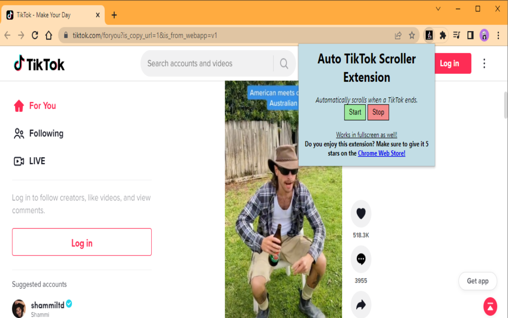

# [Auto-TikTok-Scroller](https://github.com/Tyson3101/Auto-TikTok-Scroller)

## A Chrome Extension/Bookmarklet that adds an auto-scroll feature on TikTok so you can watch TikToks without the need to touch your mouse.

#### Whenever a TikTok ends, the extension will automatically scroll to the next one for you. Great for doing homework and watching TikTok at the same time without the need to switch tabs! Just be sure to not tell your teachers.

- Bookmarklet: [Click here](https://github.com/Tyson3101/Auto-TikTok-Scroller#bookmarklet)

- Extension: [Click here](https://github.com/Tyson3101/Auto-TikTok-Scroller#extension)

###### When activated, scrolls down 8 times to load videos.

## Bookmarklet

**Go to this link and save the shown link to your bookmarks (Drag to your bookmark bar)**

Link: [https://tyson3101.github.io/Auto-TikTok-Scroller/bookmarklet/bookmarklet.html](https://tyson3101.github.io/Auto-TikTok-Scroller/bookmarklet/bookmarklet.html)

## Extension

**Option 1** – Install it from the [Chrome Web Store](https://chrome.google.com/webstore/detail/auto-tiktok-scroller/ngnmmnppfloibngkifccjiljhnjoleaa/related?hl=en-GB&authuser=0)

**Option 2** – Install it from source:

- Clone/download this repo,
- Open Chrome and go to `chrome://extensions`,
- Enable "Developer mode",
- Click "Load unpacked extension",
- Select the `extension` folder from this repo.

##### If you have any suggestions or experience problems, post an issue on the GitHub page: [https://github.com/Tyson3101/Auto-TikTok-Scroller](https://github.com/Tyson3101/Auto-TikTok-Scroller)
